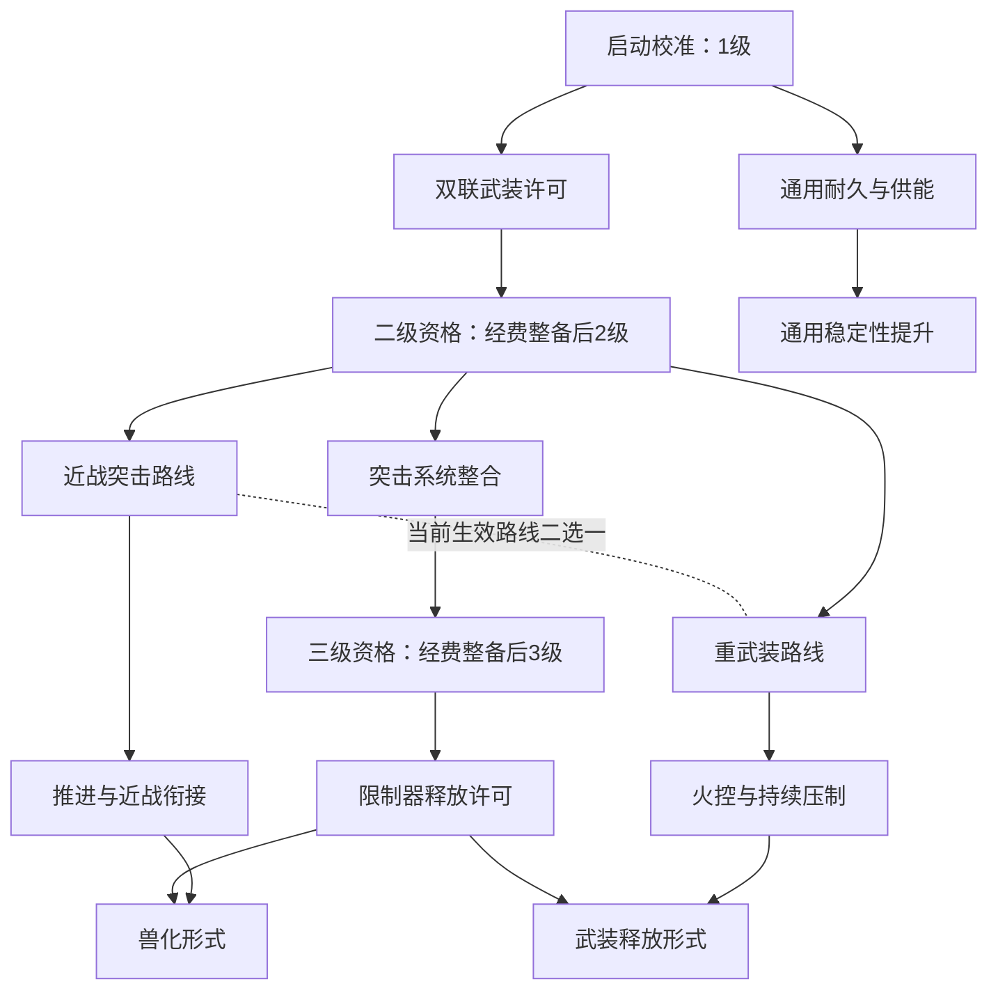

# EVA 机体、成员与养成方案 v3.1

日期：2026-09-10。状态：设计基线，尚未实现。v3.1 保留永久解锁、自由配装、两种货币、充值兑换券、精通装备与特别支援许可，补入同步作战、Boss 部位、任务变化、MAGI 演习与复盘、作战资历和战场供能六项设计。所有玩家可见资源名称沿用 EVA 风格命名；示例数值仍需试玩。

本文件是后续养成实现的唯一当前入口；v1、v2、v3 仅保留在 work/design-history 中作为历史备份。沿用合作 PvE、机体与成员分离、EVA 内容来源和现有项目架构；本轮将已讨论的六项玩法写入方案及实施顺序，尚未实现游戏功能。

## 1. 当前确定的结构

一次出战配置为：机体型号及其培养路线＋武器型号＋装备＋驾驶员＋支援成员＋技能配置＋弹药＋消耗品＋外观。

| 系统 | 负责内容 | 关键边界 |
| --- | --- | --- |
| 机体型号 | 外形、基础性能、类型、可用武器、机体成长树 | EVA 编号不等于等级；改型是独立内容条目 |
| 机体等级 | 1／2／3 级，决定装备和技能容量 | 主线解锁晋阶资格，再支付作战经费完成升级；抽到机体从 1 级开始 |
| 武器型号 | 普攻、射程、弹道、近战及弹药兼容 | 由机体主线研究解锁，独立于装备槽 |
| 装备 | 常驻属性加成、满足条件触发的被动效果 | 不提供主动按键，不解锁武器型号、机体等级或主动技能形式 |
| 成员 | 驾驶员与支援成员的统一培养对象 | 岗位不同，人物进度独立；同一人物不能在一份配置里占两个岗位 |
| 类型熟练度 | 成员对进攻／防御／平衡／支援机体的熟悉程度 | 对同类型机体生效，随实际出战提高 |
| 共鸣 | 特定成员与指定机体组合的特殊能力 | 需要解锁条件，换成不匹配机体时不生效 |
| 精通 | 成员后期对指定机体的属性加成 | 有限等级与明确目标，不能无限成长 |
| 抽奖 | 获取机体、驾驶员、支援成员及其他物资 | 获取所有权与培养进度分开 |
| 常规经济 | 作战经费、维修、补给、普通装备、机体升级 | 经费由正常战斗结算获得，不与充值货币混同 |
| 特务补给 | 特务配额、充值兑换券、常驻商品、精通装备 | 特务配额只通过充值兑换券发放，不由战斗或抽奖产出 |
| 特别支援许可 | 高级账号的限时收益提升 | 加成作战经费和培养数据，不增加战斗槽位或特务配额 |

每名玩家控制一台机体，首版编组一名驾驶员和一名远程支援成员。不同账号允许同型号、同成员组队。第十三号机预留双驾驶席，但仍由一名玩家操纵，主副驾驶共享成员技能容量和培养数据总预算。

### 1.1 玩家界面命名

| 设计概念 | 玩家可见名称 | 说明 |
| --- | --- | --- |
| 银币 | 作战经费 | 正常任务结算的可支配经费 |
| 充值金币 | 特务配额 | 用于特务补给库的付费额度 |
| 机体经验 | 机体作战数据 | 独立属于每个出战机体型号的永久研究资源 |
| 成员经验 | 人员研修数据 | 驾驶员与支援成员分别持有，界面注明获得者 |
| 全局经验 | 通用战术数据 | 可用于任意已拥有机体的研究 |
| 普通抽奖券 | 补给申请券 | 用于普通补给申请 |
| 重复抽取兑换资源 | 调拨凭证 | 用于指定内容与常规物资调拨 |
| 充值兑换券 | 特务配额兑换券 | 充值订单对应的单次兑换凭据，与抽奖券区分 |
| 高级账号 | 特别支援许可 | 生效期间提高指定战斗收益 |
| 普通商店 | 后勤整备库 | 使用作战经费购买普通装备、弹药和消耗品 |
| 高级商店 | 特务补给库 | 使用特务配额购买常驻内容、精通装备和许可 |

以上名称属于本作游戏化命名，不宣称是 EVA 官方货币。代码可保留 xp、silver、gold 等稳定字段，显示文案使用名称表；旧字段 coins 的余额按来源迁为作战经费，不能因曾显示“金币”就变成充值货币。同步率、机体同步能量继续作为战斗概念，与可消费培养数据分开。

## 2. EVA 来源与机体类型

首批以新剧场版为内容来源；TV／旧剧场版采用独立条目。型号与人物名称参考 EVA，以下类型、研发树、技能、属性和跨机体驾驶规则均是本作改编，不是原作设定。

### 2.1 四种类型

| 类型 | 核心任务 | 固有取舍 | 首批代表 |
| --- | --- | --- | --- |
| 进攻 | 爆发、压制、突破、清除高威胁目标 | 输出机会强，容错或持续防护较弱 | 二号机 |
| 防御 | 掩护、拦截伤害、为交互和输出创造安全窗口 | 生存和保护强，追击或爆发较弱 | 零号机 |
| 平衡 | 独立作战、反击、补足队伍短板 | 场景适应广，单项极限受约束 | 初号机 |
| 支援 | 标记、削弱、供能、协同火力、救援保障 | 团队收益强，需要队友或合适战斗节奏 | 八号机 |

机体有一个固定主类型和若干玩法标签。分支可以调整倾向，但不随配装反复切换主类型；类型熟练度因此有稳定归属。支援型机体与远程支援成员是两个独立概念。四类机体都具有普通射击、机动、自救与基础救援能力。

### 2.2 型号规划

| 机体系谱 | 型号内容 | 默认类型与扩展定位 | 成长处理 |
| --- | --- | --- | --- |
| 零号机系 | 零号机；其他版本另行登记 | 防御，精确掩护 | 每个型号独立经历 1／2／3 级 |
| 初号机系 | 初号机 | 平衡，反击与同步释放 | 觉醒是树中解锁的临时技能形态 |
| 二号机系 | 二号机、改二号机 β、新二号机 α | 进攻，机动突击或重武装分支 | 各型号独立培养；兽化是技能形态 |
| 八号机系 | 八号机 α、改八号机 γ；β 临时战斗构型另列 | 支援，标记与协同火力 | 改型可提供新的技能树与武器选择 |
| Mark.06 系 | Mark.06 | 支援，控制与破防 | 后续独立内容 |
| 第十三号机系 | 第十三号机 | 平衡，双驾驶同步 | 后续特殊驾驶席规则 |

基础机体可从初始赠送、抽奖、指定调拨或特务补给库购买获得；每个已获得型号都可以从 1 级直接培养，不要求先抽齐另一条机体系谱。新二号机 α 和“二号机 3 级”是不同概念。同系型号共享资料组织与部分技术模板，不直接共享机体作战数据钱包或全部已研究节点，跨型号培养依靠通用战术数据。

名称与版本参考：[BANDAI 官方机体目录](https://satellite.bandai-hobby.net/characters/eva.php)、[改二号机 β](https://www.kotobukiya.co.jp/product/detail/p4934054073931/)、[新二号机 α](https://www.kotobukiya.co.jp/product/detail/p4934054019366/)、[改八号机 γ](https://www.kotobukiya.co.jp/product/product-0000003979/)。[八号机 β 临时战斗形态](https://tamashiiweb.com/item/13186/?dmode=pc)按构型登记，不直接按名字归入短时变身。[第十三号机双驾驶原型](https://www.evastore.jp/shop/g/gC7000120/)作为以后增加副驾驶岗位的参考。

## 3. 按结果和表现结算培养数据

### 3.1 四条独立收益

| 收益 | 归属 | 消耗用途 | 试算比例 |
| --- | --- | --- | --- |
| 机体作战数据 | 本局实际出战的机体型号 | 该型号主线、特殊分支、通用分支 | 结算基准 E 的 100% |
| 驾驶员的人员研修数据 | 本局驾驶员 | 该成员个人主线、分支、通用技能、精通节点 | E 的 100% |
| 支援成员的人员研修数据 | 本局支援成员 | 该支援成员的成长树 | E 的 60% |
| 通用战术数据 | 账号共享钱包 | 补充任意已拥有机体的研究成本 | 本局机体作战数据的 10% |

四项独立发放；通用战术数据是额外奖励，不从机体作战数据里扣走。未出战机体与成员不自动获得本局专属培养数据。人员研修数据的具体比例可以调节，但驾驶员和支援都必须有可见、可解释的成长。

通用战术数据首版只跨机体使用，不直接培养成员、购买物资或抽奖。1 点通用战术数据抵扣 1 点机体节点成本，默认先使用目标机体自己的培养数据，界面明确显示需要补充的通用战术数据。不把旧机体剩余培养数据自动转换成通用战术数据，也不把花掉的通用战术数据再次按比例返还。

### 3.2 结果与表现的组成

奖励基数由服务器按任务和实际完成的阶段产生，战败也可以获得已完成阶段的奖励。个人表现不能只看伤害或最后一击，应统计机制贡献、有效输出、有效防护、有效支援和有效参与。

试算公式：

```text
B = 已完成目标和阶段对应的培养数据基数
R = 结果系数：胜利 1.2；未通关但有有效进展 1.0
O = 机制贡献标准分，0—1
D / T / H = 有效输出 / 有效防护 / 有效支援标准分，各为 0—1
A = 有效参与标准分，0—1
S = 0.4 × O + 0.4 × max(D, T, H) + 0.2 × A
E = floor(B × R × (0.8 + 0.4 × S))
```

标准分按任务设计的绝对目标和上限计算，不按两名玩家的排名分配同一份蛋糕。未设置独立机关的任务，O 使用目标推进、协助完成等适用指标；每个任务在发布时明确评分口径。取输出、防护、支援三者的最高项，是为了让分工不同的玩家有相当的表现奖励空间。

有效防护只计算真正保护了自己或队友的伤害拦截；有效治疗不包含过量治疗、友方自伤循环；有效支援计算标记转化、供能被使用、救援和机制辅助。贡献加成有上限，拖长战斗不能无限增加 B。未通过有效参与门槛的挂机账号不发奖励；网络短断线单独处理，不能直接等同挂机。

试算：B=1000、R=1.2、S=0.75，则 E=1320；机体 +1320、驾驶员 +1320、支援成员 +792、通用战术数据 +132。全部为整数，并显示奖励明细。

### 3.3 钱包与实战记录分开

每个机体和成员分别记录“累计实战获得数据”和“可用培养数据”。研究足额扣除资源后永久解锁节点，不降低累计实战记录。解锁后不提供研究退款或遗忘重学；免费换配只改变生效组合。熟练度、共鸣进度根据实际出战事件记录，不能靠配装切换、抽中重复项或使用通用战术数据伪造。

机体等级不按数据总量自动增长。主线研究解锁相应晋阶资格，支付一次性作战经费完成整备升级后，机体才正式达到 2／3 级。通用战术数据可补足研究，但不能代替升级经费或跳过前置、任务要求、成员实战条件。

## 4. 机体等级与配置容量

采用三级培养。以下是首版容量基线，数量表示同时生效或携带的上限，不表示自动获得相应技能。

| 机体等级 | 装备槽 | 战术技能槽 | 驾驶员可装特长 | 支援成员可装专长 |
| --- | --- | --- | --- | --- |
| 1 级 | 1 | 1 | 1 | 1 |
| 2 级 | 2 | 2 | 2 | 1 |
| 3 级 | 3 | 3 | 3 | 2 |

战术技能槽用于机体技能或需要独立操作的共鸣能力；它们共享容量。成员解锁主动共鸣后，装入一个战术槽或替换已有技能形式，不额外白送主动技能位。触发型共鸣占对应驾驶员特长或支援专长位置。

基础移动、普攻、基础机动、近战、基础维修与救援不占战术技能槽。装备的触发被动计入装备槽，不能绕过等级容量。已解锁的通用基础属性节点可常驻；特殊分支的属性节点只在当前选择的合法分支中生效。解锁特长或技能后仍需装入相应槽位。

武器选择独立于装备槽：一个主武器型号、一个近战型号。两种弹药与两个消耗品携行位也单列。机体升级后增加选择容量，武器与技能内容仍需沿主线研究。

升级流程为“研究晋阶节点 → 获得升级资格 → 支付作战经费完成整备 → 永久增加等级容量”。研究完成但经费不足时，资格保留，界面显示“待整备”，机体仍按当前等级出战。已完成的机体升级不因换配、维修、付费许可到期或再次选择旧武器而倒退，也不重复收费。

跨等级组队使用任务的等级上限：进入 1 级任务时采用 1 级合法容量和对应属性范围，并使用保存的低级预设；超出的槽位与高阶专属技能不偷偷保留。机库展示实际生效配置。高难任务使用完整 3 级配置。

## 5. 机体成长树：特殊主线、特殊分支、通用分支

借鉴国策树的主干、分支、条件门槛和互斥结构。HOI4 的官方域名指南说明了互斥路线以及前置条件带来的路径选择；本作采用战斗培养数据推进，不加入现实时间倒计时。[Paradox 托管的 HOI4 指南，第 20—23 页](https://forumcontent.paradoxplaza.com/public/paradox/banners/HoI_IV_Strategy_Guide.pdf)

### 5.1 三层职责

| 层 | 解锁或强化内容 | 限制 |
| --- | --- | --- |
| 机体特殊主线 | 1／2／3 级、武器型号、基本技能、终段能力资格 | 每个机体有独立主题，主线不能被换路线操作清空 |
| 特殊分支 | 特色属性、技能效果、技能形式、战斗形态 | 使用前后置、互斥组与机会成本，决定打法差异 |
| 通用分支 | 耐久、供能、稳定性、冷却等有限基础属性 | 复用节点模板，但进度和效果属于当前机体，不是全账号光环 |

“武器型号解锁”给当前机体提供使用该武器的能力。即便两个机体可研究同一种武器，接口或主线授权仍分别校验。抽到装备不会直接打开武器科技。

### 5.2 二号机样板树

主线六个节点示例：

| ID | 主线节点 | 解锁效果 |
| --- | --- | --- |
| M01 | 启动校准 | 1 级、基础武器、一个基础战术技能；获得机体时完成 |
| M02 | 双联武装许可 | 新主武器型号，形成二号机的初始火力特色 |
| M03 | 二级战斗整备 | 研究解锁晋阶资格，支付作战经费升级后获得 2 级和第二装备／战术槽 |
| M04 | 突击系统整合 | 新的机动／压制技能，接入分支形式变化 |
| M05 | 三级战斗整备 | 研究解锁晋阶资格，支付作战经费升级后获得 3 级和第三装备／战术槽 |
| M06 | 限制器释放许可 | 终段能力；具体形式由有效特殊路线决定 |



A3 要求 A2 与 M06 已解锁；B3 要求 B2 与 M06 已解锁。图中两条入线代表 AND。两侧都可花培养数据永久解锁，装入某一终段形式时，当前配置仍须满足它的激活前置。主线节点另检查所需的实际整备等级，不依赖当前选择的互斥分支。

近战路线强化推进后的衔接，兽化期间暂停常规远程射击；重武装路线形成远程压制和蓄能窗口，但限制开火期间机动。两个形式共享基础能力和冷却槽位，不能轮流开出两套终段技能。

通用分支提供少量稳定收益。每个机体的特殊分支至少要包含一个动作、资源或协作方式的变化，不能仅把“伤害 +5%”换个名字。支援机的分支不能通过通用节点消除所有团队依赖，防御机也不应最终拥有进攻机全部爆发能力。

## 6. 永久解锁、前置与自由搭配

节点解锁状态只有“前置未满足／资源不足／可解锁／已解锁”。足额投入后一次性完成解锁，首版不设置可取消的部分研究投入或离线倒计时。已解锁节点不因更换路线被清除，不重复收费，也不提供返还培养数据的操作。

当前配置另外保存“已选择／未选择／互斥／不兼容”状态。玩家可以研究两条原本互斥的路线，并分别保存在多个预设中；互斥限制同一场战斗中实际生效的组合。

| 规则 | 所在层 | 判定方式 |
| --- | --- | --- |
| 解锁前置 AND／OR | 永久研究 | 已解锁前置满足全部／任一路径要求，才可支付解锁 |
| 主线与等级门槛 | 研究和使用 | 晋阶资格看主线，等级能力看已支付经费完成的实际等级 |
| 激活前置 | 当前配置 | 装备高阶特殊节点时需满足当前分支和必要前置，不允许跨过已停用的分支节点 |
| 分支互斥 | 当前配置 | 同一组选择一条有效路线，另一侧已解锁内容保留但不生效 |
| 技能形式与槽位限制 | 当前配置 | 同组形式数量、装备槽、战术槽、成员特长槽均需符合上限 |
| 共鸣／精通条件 | 资格和使用 | 解锁时检查实战资格，生效时检查成员、机体、岗位与当前配置 |

例如近战突击和重武装两条路线均可永久学会。选择近战路线时，该路线的合法前置、属性和技能形式生效；切换到重武装时替换相应效果，已学内容仍在。技能升级形式按替换关系处理，不能让基础版与升级版重复叠加。

换配完全免费，不消耗培养数据、作战经费或特务配额。可以复制、命名并保存不同路线预设；开战时选择一份快照，战斗中不能通过切预设重置技能冷却或维修损伤。主线解锁与已完成整备等级为永久状态，通用属性按定义常驻，特殊属性按当前有效分支计算。

界面先列出已拥有的选择，再提示当前组合的冲突与可替换项。解除某个激活前置只让依赖它的当前效果停用，不撤销研究记录。资料图表达前后置与搭配互斥时使用不同线型和说明。

## 7. 成员成长树与三种适配关系

成员包括驾驶员与远程支援成员。两类岗位都获得人员研修数据，使用同一成长树规则，但效果目标和可装备容量不同。首批驾驶员为真嗣、绫波丽、式波·明日香、玛丽；薰后续加入。支援成员为美里、律子、摩耶。[官方人物介绍](https://www.evangelion.jp/2_0/chara.html)、[官方演职员名单](https://www.evangelion.jp/2_0/staff.html)

### 7.1 个人主线、分支、通用、精通

| 层 | 用途 | 示例 |
| --- | --- | --- |
| 个人主线 | 确定人物主题，解锁个人特长、共鸣资格、后期精通 | 明日香：独立操纵 → 战术专精 → 同步突破 → 王牌资格 |
| 主线分支 | 改变个人技能效果或形式，具有互斥和依赖 | 明日香：近战决斗／火力压制；绫波丽：精确援护／屏障救援 |
| 通用技能 | 基本操作、恢复、协作等有限提升 | 稳定操纵、同步管理、基础协同 |
| 精通分支 | 对明确指定的机体提供后期属性加成 | 明日香的二号机操纵精通，绫波丽的零号机屏障精通 |

驾驶员与支援成员都可以有主线、分支、通用和精通，不沿用 v1“支援成员只有一个简单专长选择”的限制。首版驾驶员可用 4 个主线、6 个专属分支、6 个通用、4 个精通节点组成样板；支援成员使用 4 个主线、4 个专属分支、2 个通用、2 个精通节点样板。样板数量用于控制制作量，不要求以后所有人物机械填满相同格子。

成员固有基础特性提供人物辨识度；需要装配的专属特长、触发共鸣和支援专长遵循机体等级容量，不能把所有被动技能解释成“已研究就全部常驻”。通用基础属性和精通属性节点可在其路线有效、目标匹配时自动生效，并计入属性上限。

### 7.2 类型熟练度

每名成员保存进攻、防御、平衡、支援四种熟练度。每次有效战斗将熟练进度计入当前机体的固定主类型；驾驶员和支援成员都获得对应进度。可用各自实战培养数据的固定系数作为计量，但熟练度不是可再次消费的培养数据货币。

每人可有一到两个初始熟悉类型，获得一定初始熟练度或更快的该类型学习速度。其他类型仍能使用并训练，基本操作无惩罚。熟练度设置有限档位，提供小幅操作收益或作为节点条件，不无限增长。

同一成员如具备多种任职资格，驾驶与支援共用一份人员研修数据和四类熟练度记录；当前岗位只启用该岗位允许的技能效果。默认熟练度增益只作用于所属机体，驾驶／支援适用属性及系数由成员定义明确列出，不能把驾驶员的近战特长在远程支援岗位上自动套用。通过副驾驶扩展上阵人数时，角色培养数据与熟练进度在预先规定的岗位总预算内分配，通用战术数据仍只结算一次。

| 成员 | 初始熟悉类型建议 | 共鸣目标建议 |
| --- | --- | --- |
| 真嗣 | 平衡 | 初号机 |
| 绫波丽 | 防御、支援 | 零号机 |
| 明日香 | 进攻 | 二号机 |
| 玛丽 | 支援、进攻 | 八号机；二号机作为后续显式条目 |
| 薰 | 平衡、支援 | Mark.06；第十三号机作为后续条目 |
| 美里 | 进攻、平衡 | 二号机的战术保障共鸣 |
| 律子 | 防御、平衡 | 初号机的技术保障共鸣 |
| 摩耶 | 支援、防御 | 零号机的同步监测共鸣 |

表中适配、共鸣和支援配对均为游戏设计。共鸣采用明确型号集合；不能仅凭名字包含“二号机”就自动覆盖所有改型。新改型是否继承共鸣，通过内容配置登记。

### 7.3 共鸣：解锁特殊能力

共鸣需要拥有成员和目标机体、达到个人主线资格、满足相关类型熟练度及有效搭配出战条件。条件不要求先使用尚未解锁的共鸣技能，避免形成循环。共鸣解锁记录长期保留，但只有当前编组匹配时才允许装备或触发。

例如：明日香＋二号机可解锁“同步突击”，推进后衔接攻击获得特殊效果；绫波丽＋零号机可解锁“守护链接”，成功掩护队友后形成短时联动屏障。美里的机体共鸣提供战术指令强化，不占驾驶席。

每名驾驶员、支援成员首版各最多装备一个共鸣效果，占自己的特长／专长容量；需要新增主动操作的共鸣改占战术技能槽，不重复占位或重复生效。共鸣可以强化、替换技能形式，但不能给没有对应装置的机体凭空制造兽化或觉醒能力。

共鸣组合允许有可感知优势，也要有触发条件和占槽成本。非共鸣驾驶员仍可能凭另一套个人分支与类型熟练度适合该任务。普通 Boss 不要求指定人物共鸣才能通关；共鸣验证要与同等级、同培养投入的非共鸣配置比较。

### 7.4 精通：对指定机体加属性

精通位于个人树后段，消耗本人员研修数据，并要求个人主线、目标机体实战进度等条件。可配置少量有限等级，强化明确属性，例如指定机体的屏障效率、武器稳定性、推进能耗。

精通不再次解锁同一个共鸣能力，不增加装备槽，也不把目标扩大成全机体。两条精通方向可以全部解锁、搭配时互斥，例如“二号机近战同步效率”与“二号机持续火控效率”。共鸣进度与精通实战条件复用同一成员—机体组合的实战记录，避免再增加第三种可消费关系数据。成员精通节点与商店售卖的精通装备分别定义，购买装备不自动完成个人精通。

## 8. 武器、装备、技能、弹药与消耗品

### 8.1 武器与装备拆开

主武器和近战型号由机体主线解锁并选择，不占装备槽。武器定义射击或挥击方式、兼容弹药、有效距离、装填和动作限制。相位、兽化、屏障展开等主动能力归机体树或成员共鸣，不由装备点击发动。

装备只能有常驻属性与触发被动：

| 装备示例 | 常驻加成 | 条件被动示例 |
| --- | --- | --- |
| 火控稳定器 | 武器稳定性提升 | 连续有效命中后，下一次射击获得有限稳定增益 |
| A.T. 缓冲衬层 | 屏障容量或效率提升 | 抵挡达到阈值后短暂获得减伤，带独立冷却 |
| 推进回收组件 | 推进能耗降低 | 成功规避标记攻击后恢复少量能量 |
| 救援协同组件 | 救援效率提升 | 完成救援后为双方提供短时屏障 |

同一机体可装备 1／2／3 件，通用槽接受不同类别，但同件装备不能重复占槽，相同效果组按规则互斥或封顶。装备不携带人物培养数据，不因换机体被消耗；首版不再增加装备升星或无限强化等级。

### 8.2 弹药与消耗品进入库存

保留精确弹、高爆弹、共振弹三类初始玩法：分别偏单体输出、集群处理、防护削弱。AP／HE／HESH 是旧系统对应类别，本作共振削弱不宣称为现实弹道效果。能量武器使用自己的兼容方案，不强行装备实弹。

基础标准弹持续可用。普通池可产出兼容的特殊弹药数量包，加入账号库存；抽到弹药不等于解锁对应武器。未拥有兼容武器时保留库存并显示未来用途。特殊弹也可以用作战经费购买，避免连续抽不到而无法尝试配置。

两个消耗品位从维修包、同步电池、临时屏障发生器等物资中选择。抽取产出可堆叠数量，使用会消耗库存；不沿用 v1 所有已解锁道具无限免费配发的规则。基础自修与救援始终可用，教学提供初始补给，作战经费可购买基础物资。

出战前显示携带量和本局最多消耗量。服务器开战时预留携行物资，战斗结束归还未使用部分，已使用数量按实际消耗结算。胜败都按使用量计费，不因失败额外清空全部库存；重连回到同一局不能重新补满。

预留、已消费与已返还分别记账，异常恢复不能把同一批物资再次发放。服务端无法确认的消耗不凭空扣除；按持久记录恢复或冻结待恢复的局次后处理。训练使用模拟库存，不扣账号物资且不发养成奖励。

装备无主动键。基础操作与三个可配置战术槽分开布局；随着等级逐步显示可用槽。成员触发被动和支援技能不再各占一排按键，共鸣形式直接体现在对应能力的名称、图标及说明中。

## 9. 抽奖池与重复获取

### 9.1 普通总池

普通池必须包含全部以下类别，每个已上线类别具有非零获得概率：

| 奖励类别 | 首次获得 | 重复获得 |
| --- | --- | --- |
| 机体 | 解锁该型号，初始为 1 级和基础主线 | 转为调拨凭证，不直接升到 2／3 级 |
| 驾驶员 | 解锁人物及基础特性 | 转为调拨凭证，不直接完成个人技能树 |
| 支援成员 | 解锁人物及支援岗位 | 转为调拨凭证，不增加额外出战岗位 |
| 装备 | 获得装备使用权 | 转为调拨凭证；首版不生成随机重复词条实例 |
| 消耗品 | 增加库存数量 | 继续增加同物品数量 |
| 弹药 | 增加兼容弹药库存 | 继续增加同弹药数量 |
| 装扮 | 解锁外观 | 转为调拨凭证；外观不提供战斗属性 |

“驾驶员”和“支援成员”在普通池里分别显示类别，底层都是带岗位的成员。机体等级、类型熟练度、共鸣和精通不能由一次重复抽取直接跳过。

调拨凭证用于定向兑换已上线的机体、成员或装备，作为重复获取的明确去向；它不是机体作战数据，也不转化为通用战术数据。初始赠送内容仍可入池，重复时遵循相同规则。所有可玩机体和成员都可以进入相应抽奖条目；planned 状态不进实际池。

首版仓库不设置玩法上的物品格数上限，弹药与消耗品按整数数量堆叠，携行上限只约束本局。若未来增加容量上限，超出部分进入不失效的待领取库存，不能扣券后丢弃；保底和掉落在抽取成功时确定，领取不再重新抽取。调拨凭证可兑换消耗品和弹药，保证全收集后仍有使用去向；奖池全收集时保持公示的重复转换规则，不抽取不存在的未拥有条目。

### 9.2 池子组织、保底和概率

首版实现普通总池；为以后增加机体定向池、成员定向池预留配置，避免复制抽奖逻辑。未来定向池分别限定到其主题奖励类别，不能把“定向机体”显示给玩家却暗中掉一堆弹药。

普通池设置“机体／驾驶员／支援成员”联合保底组：连续 N 次未获得该组，下次强制在该组内按公示条件抽取；命中组内物品即重置该组计数，已拥有的重复物也算命中，界面必须说明。定向兑换提供获得具体目标的确定路径。N、类别概率、组内权重、数量包大小和兑换价格需要结合战斗收入试算后填入版本配置，本方案不把未经验证的数字写成正式概率。

抽取过程先选奖励类别，再选具体条目和数量，应用保底时显式替换候选集合；实际概率、保底触发和重复转换均记录。保底跨常规内容更新保留；新增不同池必须分配明确的保底组，不能默认清零或隐式串池。

一次抽取的扣券、奖励、重复转换与保底变化作为同一操作落账；网络重试返回同一结果。普通概率、保底条件概率和数量包分布分别公示，不能把类别概率当作某个具体人物的获得概率。

普通抽奖继续使用通过游戏获得的补给申请券。普通池、调拨凭证与特务补给库共用内容所有权，避免同一个机体出现“抽取版”和“购买版”两份培养档案。当前不增加使用特务配额购买随机抽奖的入口；充值购买的是公示的常驻商品、精通装备或许可时长。

## 10. 作战经费与特务配额

| 资源 | 正向发放来源 | 使用范围 |
| --- | --- | --- |
| 作战经费 | 正常战斗按结果、有效表现结算；特别支援许可提高相应结算收益 | 修复机体、补充弹药与消耗品、购买普通装备、支付机体升级整备费 |
| 特务配额 | 收款确认后发放的特务配额兑换券，经服务器核销入账 | 特务补给库内的常驻机体、驾驶员、精通装备和特别支援许可 |

特务配额不由战斗、任务奖励、普通抽奖、重复物品转换、调拨凭证、卖装备或许可收益产出。两种货币不能互相兑换，常规维修与补给不得在经费不足时自动扣特务配额。余额分别显示和记录；费用、收入和货币单位不能只显示相同的黄色数字。

正常战斗同时发放作战经费和第 3 节的培养数据。经费使用自己的任务基础值，以任务进展、胜负和有效表现计算，不能直接把数据数量当作同额货币。结果页面显示毛收入、许可加成、维修费用、补给购买费用和净变动，保持“收入减支出等于余额变化”。

节点学习只消耗指定培养数据；机体晋阶是研究资格和经费整备两项独立条件。已解锁的技能、武器切换和已拥有装备的重新搭配不收费。普通装备从后勤整备库按固定标价购买永久使用权；重复已拥有物品不能误购。

## 11. 战后维修、补给与机体升级

### 11.1 维修

战内维修技能和战后整备分开：前者影响当前战斗状态，后者用作战经费消除本局结束后记录的待维修损伤。维修费根据结束损伤比例、是否击毁、型号与本局实际生效等级计算，设置明确最高费用；不按每次受伤无限累计。战内修复可以改善结束损伤，任务中临时降级不按完整 3 级配置收费。

每个型号保存自己的整备状态，换驾驶员或预设不清除损伤。支付维修费恢复待维修状态；不维修时该型号保留损伤并提示整备需求，不让玩家通过重新登录获得免费满状态。训练场不产生持久损伤。

自动维修和自动补给分别提供明确开关及价格预览，玩家启用后沿用。经费不足时停止不足部分并显示差额，不透支、不扣特务配额，也不执行未说明的购买。一次维修按损伤记录结算，重试同一操作不重复扣款。

### 11.2 补给

弹药和消耗品先使用已有库存；开战预留、战后返还未用物资的规则保持。战后补充目标数量才从后勤整备库购买缺口并消耗作战经费，不对库存中已经拥有的抽取物资再次收费。购买、携行预留、战斗消耗是三个不同操作，账目分别可见。

基础标准弹持续可用，特殊弹药和消耗品按数量补充。关内获得的临时补给注明仅本局可用，不默认变成账号库存。断线重连恢复同一份携行状态，不重新发满弹药。

建议保留一项恢复经费的“后勤整备试验”：使用临时整备的基础试验机、默认弹药，不消耗个人库存，不产生个人机体维修费用，只发少量作战经费，不发培养数据与抽奖奖励。它用于经费耗尽后的恢复；原有无奖励训练场仍保持无奖励。

### 11.3 晋阶整备

主线的二级／三级资格用机体作战数据及可补充的通用战术数据永久解锁。随后按该型号晋阶价格支付一次作战经费，提交成功才改变实际机体等级和可用槽位。每个型号每次晋阶只能支付一次；购买高阶型号也从其 1 级开始，不能跳过培养和晋阶。

资格已解锁但经费不足时可以继续使用原等级、积累经费，资格不会到期。晋阶不自动修复现有损伤，损伤比例沿用到新状态；已有待维修费用按对应损伤记录结清，避免用升级替代维修或重复计算费用。

## 12. 特务补给库与充值兑换券

### 12.1 常驻商品

| 商品 | 购买所得 | 培养边界 |
| --- | --- | --- |
| 常驻机体 | 指定型号的永久所有权 | 与抽取同一内容 ID，共享培养档案，初始 1 级 |
| 常驻驾驶员 | 指定人物的永久所有权 | 保留正常个人树、熟练度、共鸣与精通培养 |
| 精通装备 | 明确型号的永久装备使用权 | 仍然只有属性加成和触发被动，不提供主动技能或额外槽位 |
| 特别支援许可 | 指定时长的高级账号权益 | 按第 13 节提高收益，不改变战斗面板、等级或匹配权限 |

商品使用特务配额明码标价，展示目标、适用机体／类型、效果、触发条件和已有状态。已拥有机体、驾驶员或永久装备时禁用重复购买，避免把付费购买变成不知情的重复转换。普通抽取仍按原重复物品规则处理。

精通装备可以提供更高的定向属性或更有价值的条件被动，但仍计入现有装备槽、同组限制和数值预算。它与成员树里的“精通”是两类内容；购买后不会解锁成员共鸣、提高类型熟练度或完成机体研究。首版精通装备归特务补给库，不加入普通装备池或普通经费商店。

同一机体或驾驶员从哪个渠道获得不影响基础属性和培养上限。特务配额不直接购买等级、研究节点、机体作战数据或人员研修数据，避免把已经确定的成长流程变成同义的多种付费按钮。

### 12.2 充值与核销流程

产品流程为：选择配额档位 → 确认实际收款 → 发放对应的特务配额兑换券 → 玩家输入券码 → 服务器核销并将配额记入账号。首版可由管理端核对收款后发券，支付渠道接入另行实现；不能把前端“已付款”按钮当作收款证明。

兑换券记录订单、档位、配额面额、券状态和使用账号。面额由服务端发行记录决定，不接受客户端自由填写。券码使用不可预测的唯一值，服务端安全保存核验信息；公开日志和战绩不显示完整券码。已使用券不能被另一账号再次使用，同一账号网络重试返回原核销结果。

券码核销、充值订单状态和配额入账作为一次操作完成，失败不出现“券已消耗但余额没增加”。管理端补发时关联原订单，撤销尚未使用的旧券；不能让同一订单同时存在两份有效可重复入账的面额。

特务配额兑换券只用于充值入账，与补给申请券、调拨凭证分开，不进入战斗奖励或抽奖池。交易失败或原订单撤销时走原交易回滚和对账，不作为新的免费配额发行渠道。本轮只定义流程，不生成真实券码、收款或发放配额。

## 13. 特别支援许可

“特别支援许可”是高级账号的玩家可见名称。通过特务补给库购买指定有效时长，权益在激活后按真实时间运行；续期从 max（当前时间，现有到期时间）向后增加，不覆盖剩余时长，也不乘法叠加多份相同许可。

首版建议：战斗结算的作战经费毛收入 +50%，机体作战数据与人员研修数据 +50%。通用战术数据继续按已加成后的机体作战数据取 10%，不再额外乘一次许可系数。具体倍率和时长价格后续在数值表中确定。

| 项目 | 普通账号示例 | 许可生效示例 |
| --- | --- | --- |
| 机体作战数据 | 1320 | 1980 |
| 驾驶员的人员研修数据 | 1320 | 1980 |
| 支援成员的人员研修数据 | 792 | 1188 |
| 通用战术数据 | 132 | 198 |
| 作战经费毛收入 | 2000 | 3000 |
| 相同维修与补给购买费用 | 700 | 700 |
| 经费净增加 | 1300 | 2300 |

经费加成应用于毛收入，维修与补给费用不随许可自动打折，也不把净收入 +50% 当作相同算法。精确计算顺序为：令 E0 等于第 3 节已经取整的基准 E，许可数据系数为 P，则机体奖励=floor(E0×P)、驾驶员奖励=floor(E0×P)、支援成员奖励=floor(E0×0.6×P)、通用奖励=floor(机体奖励×0.1)。支援的岗位比例和许可倍率合并后只取整一次。经费毛收入=floor(普通账号经费基准×经费许可系数)，界面明示结果。

许可不产出特务配额、不提高抽奖概率或保底、不赠送战斗能力。类型熟练度、共鸣搭配实战进度按未加成的有效战斗记录计算，成员精通仍需正常条件与数据解锁；高级账号加快研究数据获取，不伪造实际出战次数。

本局权益以服务器开战时的许可状态为准并保存快照。中途到期仍按开局权益结算，战斗中购买从下一局生效；断线重连和结算重试不改变本局倍率。许可到期只停止后续收益加成，已拥有物品、等级、数据和配置全部保留。

## 14. 合作、数值与内容差异

首版两名玩家都保有独立操作、救援与任务贡献空间。Boss 需要两名不同参战实体参与，不检查特定人物名字、机体类型或共鸣组合。玩家可以携带同一驾驶员，但培养数据、技能、物资和战绩按各自账号与本局实体记录。

机体成长主线决定容量，特殊分支决定打法，成员类型熟练度决定适应，共鸣决定组合能力，精通和装备补充属性。不同来源不能都被简化为伤害乘数。

达到 3 级不代表学会整棵树，机体作战数据仍可用于未解锁的特殊与通用节点。全部已上线节点解锁后，数据继续作为该机体可用余额保留，以备新增内容；正常通用战术数据仍发放，不自动提高转换比例。成员资源同样可保留，但类型熟练度和精通在各自上限停止增加战力。切换已学技能不产生新的研究奖励。

常驻属性按型号与武器基础值、有效机体树、有效成员树、熟练度、精通、装备逐项汇总；同组加成采用明确的相加或上限，最后应用任务等级限制。临时状态独立计算，不能把冷却、弹数、贯穿、屏障和额外攻击当作普通百分比遗漏。

每个效果必须定义触发事件、目标、来源、内部冷却、持续时间、叠加组和上限。被动产生的事件不能无限触发自己或另一件装备；同组支援增益取较强者并刷新，不能通过两名相同支援成员保持永久增益。

支援默认作用于所属机体，影响队友时使用所属机体的位置作为范围中心；本机倒地时暂停新触发，已有区域按原时限消失。贡献归属所属参战玩家，不额外生成一份账号货币奖励，但该支援成员获得第 3 节规定的人员研修数据。

觉醒和兽化等形态由玩家主动使用，具有明确进入条件、持续时间、退出和恢复规则；不能随机夺走操作，也不能忽略 Boss 防护阶段。切弹、切形态与换技能形式都不能重置未结束冷却。

### 14.1 双人同步作战

成员—机体共鸣之外，增加两名玩家通过动作衔接产生的同步作战。它属于战斗规则，不增加新的等级、货币或需要抽取的队伍角色。所有普通编组都应能完成至少一种基础同步动作。

首轮采用两个可观察样板：

| 同步动作 | 两人的配合 | 成功反馈与效果方向 |
| --- | --- | --- |
| 交叉火力 | 一名玩家有效压制，另一名玩家在限定时间内从不同攻击方向命中同一目标 | 明确标记协同成功，形成短暂破防或输出机会 |
| 屏障掩护 | 一名玩家用屏障抵挡实际威胁，另一名玩家在掩护区域内完成蓄能攻击 | 显示掩护成立与蓄能状态，强化这次有效攻击或提高其稳定性 |

触发依赖两个不同参战实体、有效动作、目标与时序；不能由同一玩家的装备被动代替第二个人。复用现有操作，不另设一组同步快捷键。准备、可跟进、触发成功和进入冷却均向双方显示，并提供不依赖文字聊天的目标标记。

每种同步动作定义时间窗、空间条件、触发上限和共享冷却。协同效果计入原有技能叠加预算，不跳过 Boss 防护阶段。贡献归入已有有效支援、输出或机制评分，并按原上限处理，不重复发放额外一套培养数据。

### 14.2 Boss 部位与行为破坏

部分 Boss 设置两到三个有明确轮廓、命中反馈和状态图标的部位。首个样板使用武器部位、防护发生器和核心；部位是该 Boss 的阶段与攻击机制组成，不要求所有普通敌人都加入部位系统。

| 部位 | 玩家选择 | 战斗变化 |
| --- | --- | --- |
| 武器部位 | 优先处理威胁，牺牲一部分直接攻击核心的时间 | 暂时停止一种攻击或减弱攻击频率 |
| 防护发生器 | 分工处理指定目标 | 达成当前阶段条件后形成核心暴露窗口 |
| 核心 | 在窗口内集中输出 | 推进 Boss 生命或阶段 |

部位破坏不得暗中跳过任务要求的双人机制；可以将两处部位分别交给两名玩家处理，作为协作条件的一部分。损伤反馈明确区分“部位有效受损”“核心仍被保护”“该部位已失效”。

首版不实现完整装甲穿透、断肢物理或每个部位的独立装备掉落。明确部位耐久与本体伤害如何关联，同一伤害事件不能在部位和核心之间重复计入有效输出。临时失效部位恢复前有提示，连续压制存在上限，避免 Boss 永久无法行动。

### 14.3 任务目标与战场条件

任务不只区分敌人血量。内容层采用护送、阵地防御、目标突袭三种基础目标，分别检验机动保护、区域维持和集中突破。当前验证任务先使用一种目标，后续复用关卡资源扩展另外两种。

任务可叠加少量提前公布的战场条件，例如敌群密集、增援频繁、供能受限。首轮每任务最多启用一个已人工验证的条件，后续再验证组合；供能受限必须等待第 14.6 节系统完成后才可启用。

战前情报展示目标、主要敌人和部位威胁、战场条件、任务等级、奖励口径及维修补给规则，并可查看队友计划承担的职责。推荐配置只提示适合方向，不能把某个付费人物、共鸣或精通装备变成入场要求。

条件与敌人配置在开局固定，战绩保存任务版本和条件。使用随机编排时保存种子，重连不重新抽取条件；难度和奖励倍率在进入前公布，不在玩家付出物资后暗中改变。

### 14.4 MAGI 模拟演习与配装复盘

将训练入口扩展为 MAGI 模拟演习。玩家可试用已上线但未拥有的机体、成员、武器和装备，包括精通装备；可模拟不同永久解锁路线、机体等级和技能组合，但不能绕过该组合的槽位、互斥与兼容规则。

使用固定目标、距离、测试时长、任务条件和随机种子比较两套配置，展示有效伤害、部位处理、被动触发次数、屏障有效吸收、能量消耗及技能空窗。双人演习允许两名玩家共同试配；单人入口通过固定行为的模拟队友验证掩护和协作，不把它扩展为正式 AI 队友玩法。

演习状态与真实账号严格分开：不发作战经费、培养数据、熟练度、共鸣实战进度或资历奖励，不扣个人库存，不产生持久损伤，也不修改正式机体整备等级。未拥有的配置可保存为目标方案，实战使用前仍检查所有权、永久解锁、整备等级及物资。原有“后勤整备试验”是单独的经费恢复任务，其奖励规则不扩展到 MAGI 演习。

正式战斗复盘增加一到两条有事件证据的观察，例如“两次核心暴露期间，爆发技能均未就绪”或“本局携带的特殊弹没有使用”。可以从结算切到对应阶段的无收益演习，复习预警、配装与操作；正式重试继续按既有任务规则结算。

复盘不把时间上的同时出现直接认定为失败原因，不只用总伤害评价辅助玩家。配置比较和正式复盘都展示规则版本与任务条件；没有记录到的数据不生成推测性的精确数值。

### 14.5 作战资历与人物专项档案

为完成机体三级和主要节点后的玩家提供长期目标：达成明确玩法挑战后获得称号、机体涂装、驾驶员展示动作、人物对话或档案片段。奖励主要体现荣誉、收藏和角色表达，不继续叠加无限常驻属性。

首批挑战可以包括全员存活完成指定难度任务、用三条有效不同路线完成同一任务、完成一定次数有效掩护或救援。按任务等级、版本、实际路线和有效事件认定，不能通过修改预设名称把同一打法算作三条路线，也不能通过演习或重复提交结算刷取。

专项档案围绕对应驾驶员和机体的主题展开，明确标记本作原创情节与 EVA 资料来源。挑战和剧情不锁住其他普通任务，也不增加每日必须完成的进度门槛。

一次性资历奖励按挑战 ID 记录，已解锁外观与商店、抽奖共用所有权。特别支援许可不会放大资历奖励或跳过挑战。已学习技能可以自由换配，不需要为了保留某项称号长期锁定同一条路线。

### 14.6 EVA 风格战场供能

以 EVA 脐带电缆的视觉意象设计供能站、应急电源和断电区域；造型参考可从[授权模型资料](https://www.kotobukiya.co.jp/product/detail/p4934054073986/)定位。具体供能规则为本作改编，不把所有机体强行设定成同一种原作供电方式。

玩法循环是控制供能点、离开供能区执行突破、返回或寻找备用点。防御机维持阵地，进攻机处理远处目标，支援配置改善队伍持续行动能力；职责可以通过不同配置承担，不检查必须使用某位人物。

首版用供能区域和简单连接表现，不模拟电缆碰撞、缠绕或复杂布线。优先影响既有同步能量的恢复与技能使用节奏，不另加第二套电力货币；低能量仍保留基础移动和标准攻击。任务必须提供可达的备用补能路线，不能因一次断电让玩家无法继续。

这是后续场景特色，按任务显式启用。既有任务默认关闭，不要求为了接入该系统重做所有地图。应急电源在本局使用，不兑换为特务配额、培养数据或额外永久库存。

### 14.7 六项内容的先后顺序

| 优先级 | 内容 | 最小交付与判断依据 |
| --- | --- | --- |
| 第一批 | 双人同步作战 | 两种动作样板，双方能看懂准备状态并有意完成配合 |
| 第一批 | Boss 部位 | 一个两到三个部位的 Boss，选不同部位确实改变战斗节奏 |
| 第一批 | MAGI 演习与复盘 | 可比较两套配置、试用未拥有内容、复习一个阶段，演习不影响真实进度 |
| 第二批 | 任务目标与战场条件 | 扩展至三类目标和少量已验证条件，让不同配装有对应场景 |
| 第二批 | 作战资历与专项档案 | 少量明确挑战和外观／档案奖励，培养完成后仍有目标 |
| 后续特色 | 战场供能 | 一张实验场景验证供能点与行动路线，先不推广到全部地图 |

先用第一批内容验证现有技能树、机体类型和装备的实际差异，再扩大数量。六项已纳入设计，不表示必须与养成首版同时全部实现。

## 15. 扩展数据与保存约定

内容定义与账号状态分开。新增普通机体、成员、装备以配置和资源为主；出现新的战斗机制才增加对应模拟处理器与行为验证。

| 数据对象 | 关键字段或关系 |
| --- | --- |
| `MachineDefinition` | 稳定 ID、系谱、固定类型、玩法标签、基础属性、武器兼容、机体树、等级容量表、资源引用 |
| `WeaponDefinition` | 稳定 ID、武器型号、动作与弹道、弹药兼容、机体授权要求；与装备分表 |
| `MemberDefinition` | 人物版本、可任岗位、初始熟悉类型、个人树、共鸣目标、精通定义、表现资源 |
| `ProgressionNode` | 所属机体／成员、AND／OR 解锁前置、激活前置、条件锁、配置互斥组、培养数据成本、永久解锁内容与效果引用 |
| `ProgressionState` | 永久已解锁节点和解锁流水；当前选择属于预设，不写成第二份研究进度 |
| `MachineProgress` | 型号 ID、累计作战数据、可用机体作战数据、已解锁晋阶资格、已完成整备等级、待维修损伤；实际等级以整备交易为准 |
| `MemberProgress` | 成员 ID、累计实战培养数据、可消费人员研修数据、四类熟练进度、机体搭配实战记录、个人树状态 |
| `ResonanceDefinition` | 成员 ID、明确目标型号集合、资格条件、技能效果及占槽规则 |
| `MasteryDefinition` | 目标型号集合、个人前置、有限等级、属性加成；不混入全类型熟练度 |
| `EquipmentDefinition` | 普通／精通类别、常驻加成、触发被动、兼容和叠加限制、获取渠道；没有可主动调用字段 |
| `AmmoDefinition` / `ConsumableDefinition` | 类型、兼容、单位、效果、库存和携行限制 |
| `Inventory` | 机体／成员／装备／外观所有权，以及弹药／消耗品数量；抽取重复按类别处理 |
| `AccountWallet` | 作战经费、特务配额、通用战术数据、补给申请券、调拨凭证，分别记账 |
| `LoadoutPreset` | 型号、成员岗位、武器、装备、当前分支、技能和共鸣、弹药和消耗品携行量、外观；不复制永久研究或培养数据 |
| `DropTable` / `PityState` | 池版本、类别与条目概率、数量分布、保底组与阈值、累计计数、重复转换表 |
| `StoreOffer` | 商品 ID、永久内容或许可时长、价格、唯一货币、常驻状态、资格和已拥有检查 |
| `RechargeOrder` / `QuotaVoucher` | 收款记录、档位、面额、券核验信息、状态、关联订单、核销账号及唯一入账流水 |
| `SupportLicense` | 账号、权益类型、到期时间、许可倍率与规则版本，续期交易记录 |
| `MaintenanceRecord` / `UpgradeRecord` | 损伤来源与维修价、晋阶资格、经费价格、实际等级变动、唯一操作 ID |
| `BattleRecord` / `RewardLedger` | 账号、局次、参战实体、配置与许可快照、评分、各类数据、经费毛收入、维修补给和净变动、库存结算、规则版本 |
| `CoopActionDefinition` | 两名不同参与者、有效动作、时间与空间条件、反馈、共享冷却、效果和贡献归属 |
| `BossPartDefinition` / `BossPartState` | 部位 ID、耐久、当前状态、命中区域、关联攻击或阶段、伤害归属与恢复规则 |
| `MissionDefinition` / `MissionCondition` | 目标类型、敌人与部位配置、公开条件、任务等级、奖励口径、版本和编排种子 |
| `SimulationPreset` / `BattleReview` | 演习专用配置、固定测试条件、真实战斗事件引用、指标与观察；不能替代账号所有权 |
| `ServiceChallenge` / `ServiceRecord` | 资历挑战条件、有效路线与事件、一次性完成状态、外观与档案奖励引用 |
| `PowerZoneDefinition` | 按任务启用的供能区域、备用点、恢复修正和场景表现，不定义新的账号资源 |

晋阶资格由永久主线解锁记录决定，实际等级由经费整备交易决定；两者含义不同，不能只增加一列 level 后同时用两套逻辑写入。机体等级不再使用 `1 + floor(xp / 300)`。通用战术数据只在解锁操作时明确扣账，不增加累计实战数据。所有节点只解锁一次，切预设只读取永久解锁，不产生退款或再次收费。

字段示意：`machine.rebuild.eva02.base`、`member.rebuild.asuka.shikinami`、`tree.machine.eva02`、`resonance.asuka.eva02`。显示名称、皮肤和排序变化不改 ID。相同人物不同作品版本明确区分；来源字段保留 `sourceContinuity`、`sourceRefs`、`adaptationNote`，本作原创效果明确标注。

常规内容新增必须检查：节点 ID 唯一、引用有效、研究图无环、AND／OR 路径可达、研究前置与激活前置可区分、配置互斥不撤销永久解锁、类型熟练度与共鸣无循环前置、掉落不含特务配额或充值券、商店价格货币正确、所有合法配置都能完成普通任务。

服务器开战冻结账号、参战实体、实际机体等级、当前有效分支、成员、物资、许可资格与规则版本。机库和许可购买只影响下一局。战斗数据、经费奖励和物资使用按同一结果只结算一次；后续自动维修和补给购买分别使用独立操作记录，并在结算页归并展示。失败重试不能重复发奖、扣费或清空损伤。

演习、经费恢复试验和正式任务必须有独立的模式标识与奖励策略，不能仅由客户端隐藏奖励按钮来区分。同步动作、部位变化和资历条件复用服务器有效战斗事件，不依赖客户端自行上报成就；演习产生的事件不能进入正式养成与资历流水。

## 16. 现有系统迁移

当前机体和成员仍在部分类型及技能逻辑中通过 Asuka／Rei 耦合，需要按对象拆分；项目并行开发中的房间、内容和持久层修复应复用，实施前重新核对已落地状态。[类型定义](../packages/simulation/src/types.ts)、[模拟逻辑](../packages/simulation/src/engine.ts)、[档案服务](../server/profiles.cjs)

| 当前对象或规则 | v3 迁移方向 |
| --- | --- |
| 按 Asuka／Rei 保存的培养数据 | 原值保留为对应驾驶员累计数据；可用预算和映射解锁按同一转换表确定，不凭空生成历史支援数据 |
| 原按角色保存的机体配置 | 生成旧明日香／旧绫波丽预设，绑定二号机／零号机与对应驾驶员 |
| 旧 coins、普通装备与抽奖券 | 旧 coins 全额迁为作战经费，保留装备所有权与补给申请券；特务配额初始为 0 |
| 旧研究或当前设计中的路线选择 | 保留有效的永久解锁记录，当前分支选择迁入预设，不清除已学内容 |
| 新充值、高级账号与整备状态 | 没有真实充值或购买记录时不补造配额和许可；旧机体初始正常整备，不追收历史维修费 |
| 旧主武器和主动配件概念 | 射击／近战型号迁入武器，主动装置迁入机体技能树；纯属性和触发被动保留为装备 |
| 旧技能树 | 为当前节点逐项映射到机体主线／分支、成员树或武器授权，不依名字自动猜归属 |
| 旧培养数据等级和固定五点预算 | 停止使用；迁入主线解锁的 1／2／3 级与新槽位容量，提供迁移前后配置差异 |
| 原不计数量的弹药与补给 | 基础弹继续可用；新库存从明确赠送开始，不能捏造历史消耗或追扣作战经费 |
| 旧补给与保底 | 保留记录，使用明确的新旧池／保底映射和补偿规则，不重置玩家已有进度 |
| 旧按角色定位的结算 | 按账号、局次和参战实体定位，记录各培养数据与物资变化 |
| 旧战绩 | 按当时保存字段展示，不补造历史机体作战数据、支援身份、熟练度或共鸣 |

迁移前备份档案。沿用项目已有保存层结构／内容版本，不在 JSON 内增加同义版本副本。转换在事务内完成，可重复运行但只执行一次实际奖励和解锁；失败整笔回滚。

旧角色等级不能直接当新机体等级，旧技能成本不能直接用新成本覆盖。按明确映射补齐旧已用能力所需的永久主线与实际容量；需要保留旧容量的整备升级记录为一次性迁移授予，不追扣经费。旧人员研修数据区分累计值、可用余额与迁移解锁，新机体作战数据和通用战术数据从 0 开始，不能把一份旧数据同时复制到所有钱包。旧 coins 无论历史上显示什么名字，都不自动转换成特务配额。

技术实施前生成逐账号差异预览，核对所有权、预算、有效节点、容量与库存；本轮只定义迁移规则，不执行存档转换。

## 17. 首版范围与实施顺序

完整首版沿用 v2 的四类样板：4 台基础机体、4 名驾驶员、3 名支援成员，共 48 种基础编组，不含装备、技能和研究路线变化。

完整首版包含：

- 零号机、初号机、二号机、八号机 α，各一套 1／2／3 级成长主线和具有互斥的特殊分支、通用分支。
- 绫波丽、真嗣、明日香、玛丽，以及美里、律子、摩耶，各有岗位适用的个人主线、分支、通用和精通。
- 每名首版成员至少一个明确共鸣目标，四类熟练度可记录、训练并正确生效。
- 至少 3 种主武器和 2 种近战型号；9 件仅提供属性和触发被动的装备。
- 3 类初始弹药、3 种消耗品、首批外观；普通池覆盖机体、两类成员、装备、消耗品、弹药、装扮七类奖励。
- 作战经费结算、维修与补给购买、晋阶经费支付；特务补给库常驻商品、首批精通装备、充值兑换券与特别支援许可。
- 一场能检验输出、防护、支援和机关贡献的合作任务，再接入现有战役。
- 在上述验证任务中优先接入两种同步动作、一个部位 Boss，以及 MAGI 演习和基础复盘；任务多样性、作战资历和供能按第 14.7 节逐批增加。

| 阶段 | 交付 | 通过条件 |
| --- | --- | --- |
| A：培养数据与身份 | 出战机体、成员、支援独立；评分、四份培养数据收益和参战身份 | 同一驾驶员跨账号组队不串档；辅助分工可得合理培养数据；结算重试不重复 |
| B：成长主干 | 永久研究、经费整备的 1／2／3 级、武器与装备分离、自由预设 | 换配不收费不丢节点，资格和实际等级正确区分，配置互斥有效 |
| C：成员关系 | 个人树、类型熟练度、共鸣、精通 | 换类型／换机体时收益按条件变化；共鸣和精通有不同作用 |
| D：常规经济 | 普通总池、经费结算、维修、库存与补给购买 | 七类奖励完整落账，经费收支守恒，物资不重复收费 |
| E：特务补给 | 兑换券核销、特务配额、常驻商品、精通装备、许可 | 配额来源唯一，购买和续期可回读，许可加成只计算一次 |
| F：补齐与试玩 | 48 种基础编组、四类完整内容、现有战役接入 | 分工组合可通关，普通与许可账户的经费循环均可持续 |

A 至 C 阶段的战斗样板同步验证第 14.7 节第一批内容，避免先制作完全部养成内容才检查打法差异。阶段 F 完成基础验证后，扩展三类任务与资历档案；供能保留为单独场景实验。这些优先级不改变既有货币来源、永久解锁、免费配装和充值规则。

必要验证包括：胜败表现结算、永久解锁只付一次、两条路线均学会后可免费换配、激活前置和互斥有效、学习晋阶资格后需完成经费整备、换预设不维修机体、经费不足不扣特务配额、库存不重复收费、重复抽取不升级、充值券只核销一次、旧 coins 不变充值配额、许可续期与到期、通用战术数据不重复享受许可倍率、物资返还、旧档案迁移。

新增玩法验证还需覆盖：同步必须由两名不同玩家有效触发、共享冷却与贡献不重复计算、部位破坏不跳过阶段或重复计伤、公开任务条件与实际一致、MAGI 不污染真实库存和成长、复盘可追溯到事件、资历只发一次、供能不足仍有可行动和恢复的路径。

## 18. 参数状态与后续工作

本版固定永久解锁、免费搭配、四类机体、三级容量、成员关系、普通补给，以及作战经费／特务配额与许可的职责。100%／100%／60%／10% 培养数据比例、许可 +50% 毛收益、容量和节点样板属于当前建议参数。研究成本、晋阶费、维修价、补给价、兑换券面额与充值价格、常驻商品价格、许可时长、熟练度与共鸣条件、精通装备效果、概率与保底需进入下一步数值表。

第 14 节六项内容已纳入方案。同步时间窗、部位耐久与恢复时间、任务条件强度、演习指标、资历挑战数量和供能恢复参数在各自样板中确定；不再借这些系统增加新的培养等级或货币。

不得把未经测算的概率当已上线规则，也不把本方案当作新功能已实现的证据。后续修改沿用本文件，关联更新培养数据、节点、容量、掉落、库存、技能说明和迁移规则；不只改界面名称而保留相互矛盾的旧行为。
